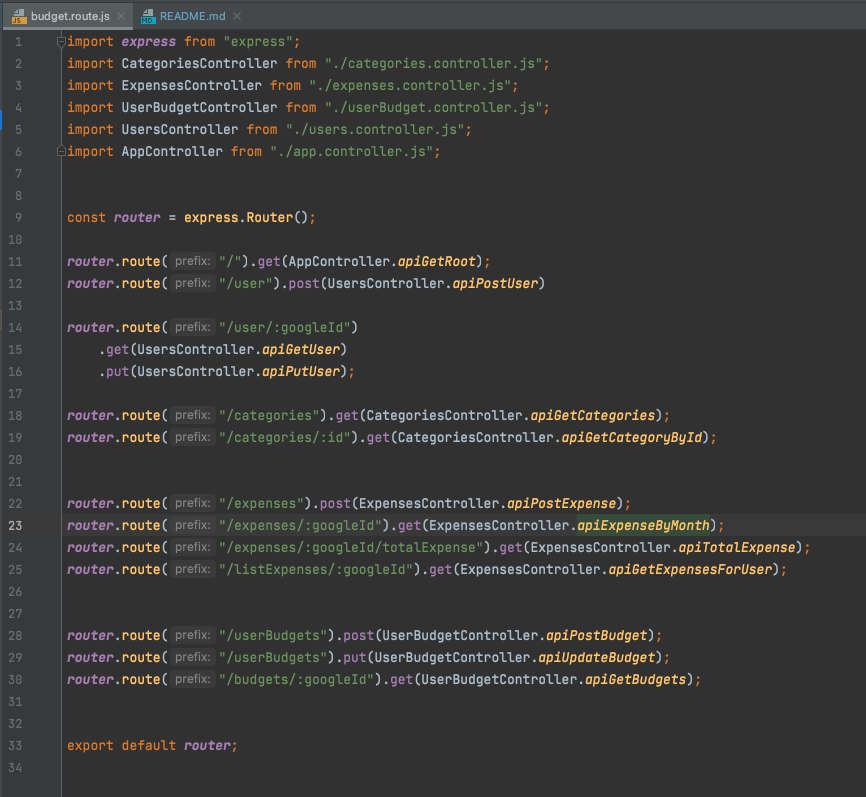
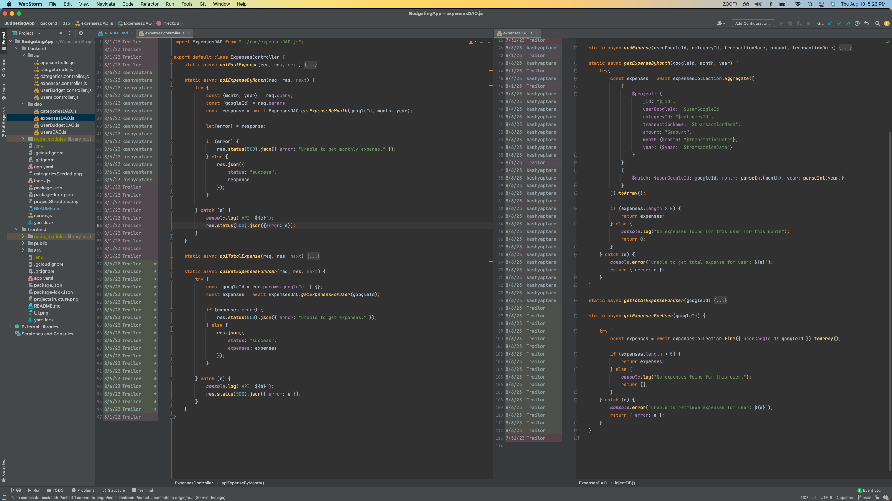
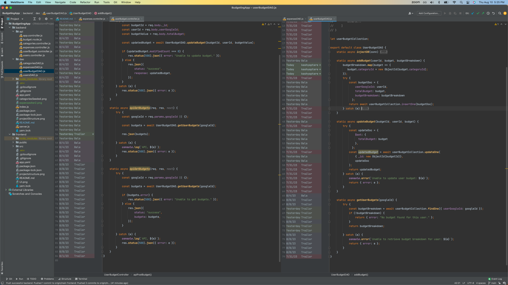
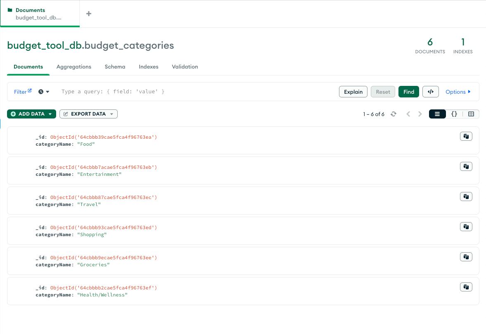
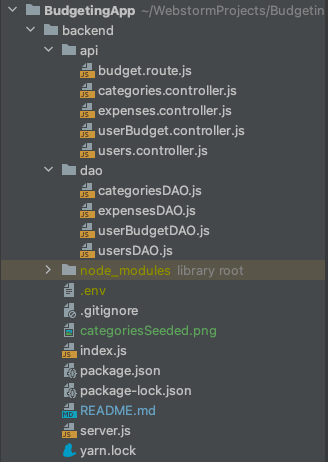

Jonathan Trailor \
Kash Tare \
Anurathi Bala \
CS5610 \
Summer, 2023 \
Final Project \
Group: Team 1

---

# Iteration 3

---

### Tasks achieved:
> All backend routes were tested and completed  
> 1 new route was added to the Categories Controller and DAO by Kash.

### "User interface with data by at least 2 CRUD operations (create, read, update, delete) for at least one database table":
The following screenshot depicts all of our CRUD operations

#Iteration 2

---

### Tasks achieved:
> Jon Trailer added a route to get budgets for each user, the controller handler for the route, and the dao method  
> Kash Tare added routes for creating and retreiving expenses, the controller handlers for the routes, and the dao methods  
> Anu Bala added routes for creating and updating budgets, the controller handlers for the routes, and the dao methods  
> Ensured the database has all necessary collections with example documents

### Screenshot of expenses controller and expenses DAO

### Screenshot of budgets controller and DAO

#Iteration 1

---

### Tasks achieved:
> Jon Trailor added the basic structure of the backend and the connection to the db  
> Kash added a categroy controller, updateUser controller, and updateUser dao method  
> Anu added routes for the budgets api and created controller handlers for the budgets api

### Screenshot of the database with categories seeded

### Screenshot of the overall project structure

# GCloud Commands

---

#### List All Projects
*gcloud projects list*
### List Current Project
*gcloud config list*
### Switch Projects For App Deploy
*gcloud config set project < number >*